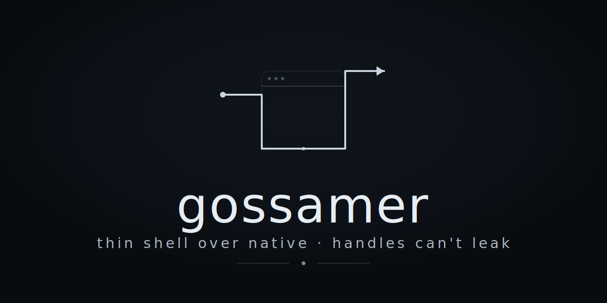

<!--
SPDX-License-Identifier: CC-BY-SA-4.0
SPDX-FileCopyrightText: 2025-2026 Jonathan D.A. Jewell <j.d.a.jewell@open.ac.uk>
-->

[](https://www.bestpractices.dev/en/projects/new?repo_url=https://github.com/hyperpolymath/gossamer)
[](https://github.com/hyperpolymath/palimpsest-license) [](https://github.com/hyperpolymath/gossamer/releases)  [](https://securityscorecards.dev/viewer/?uri=github.com/hyperpolymath/gossamer)  [](https://www.thegreenwebfoundation.org/green-web-check/?url=jewell.nexus)

<p align="center"></p>

**Build desktop apps that can’t leak resources. By design, not by
discipline.**

Gossamer wraps your web frontend in a native window — like Tauri or
Electron — but the compiler proves your app handles every resource
correctly. Leaked handles, dangling references, and permission bypasses
become compile errors instead of production incidents.

<div id="toc">

</div>

# Why Gossamer

Every desktop framework asks you to manage resources carefully. Gossamer
makes it impossible to get wrong:

- **Webview handles can’t leak.** The type system requires every handle
  to be properly closed. Forget to close one? The code won’t compile.

- **IPC messages can’t mismatch.** Frontend and backend agree on message
  shapes at compile time, not at runtime when your user hits the bug.

- **Permissions can’t be bypassed.** Access control is enforced by the
  compiler, not by a JSON config file that might have a typo.

- **No garbage collector. Ever.** Region-based memory with linear types
  means deterministic, zero-overhead cleanup. No pauses, no surprises.

# At a Glance

|  | Electron | Tauri | Wails | **Gossamer** |
|----|----|----|----|----|
| Handle leaks possible? | Yes | Yes | Yes | **No (compile error)** |
| IPC type-safe? | No | Partial | No | **Yes (compile-time)** |
| Permission enforcement | Opt-in | Runtime config | None | **Compiler-enforced** |
| Garbage collector | V8 + Node GC | None\* | Go GC | **None, ever** |
| Smallest binary | ~150MB | ~3MB | ~5MB | **~1MB** |

*\* Tauri uses reference counting internally (`Arc<Mutex<…>>`).*

# What it Looks Like

    fn main(): I64 =
      let! window = __ffi("gossamer_create", "My App", 800, 600, 1, 1, 0) in
      let! _      = __ffi("gossamer_load_html", window, "<h1>Hello!</h1>") in
      __ffi("gossamer_run", window)

The `let!` means this handle is *linear* — it must be used exactly once.
Remove the last line and the compiler rejects your program. Try to use
`window` after `gossamer_run` and the compiler rejects your program. No
runtime checks needed.

# How it Works

Your web frontend runs inside the OS webview (WebKitGTK on Linux,
WKWebView on macOS, WebView2 on Windows). The backend is written in
[Ephapax](https://github.com/hyperpolymath/ephapax), a language with two
binding modes:

- `let` `x` `=` `…` — use at most once, implicit cleanup is fine

- `let!` `x` `=` `…` — use exactly once, compiler enforces it

Resources that matter (windows, connections, file handles) use `let!`.
Everything else uses `let`. You declare your intent, the compiler
enforces it.

Memory is managed through regions — scoped arenas that free everything
at once when they exit. Linear types guarantee nothing escapes the
region. Result: no GC, no reference counting, no tracing, no overhead.

The native layer is pure Zig calling the OS webview directly. At runtime
there’s no VM, no interpreter, no garbage collector. Just your app and
the OS.

# Quick Start

```bash
# Dependencies (Fedora)
sudo dnf install gtk3-devel webkit2gtk4.1-devel zig

# Build the native library
cd src/interface/ffi && zig build

# Build the compiler
git clone https://github.com/hyperpolymath/ephapax
cd ephapax && cargo build -p ephapax-cli

# Run the hello example
cd gossamer && bash examples/hello/run.sh
```

# Features

- **Async IPC** — `gossamer_channel_bind_async()` spawns callbacks on a
  worker thread with 256-slot inflight tracker. Responses post back to
  the GTK main thread via `g_idle_add`. Rust and AffineScript bindings
  included.

- **CSP enforcement** — `gossamer_set_csp()` applies Content Security
  Policy at runtime. CLI auto-loads CSP from `gossamer.conf.json`.

- **Streaming events** (backend→frontend push) — `gossamer_emit()`
  pushes named events to the frontend thread-safely. JS, Rust, and
  AffineScript bindings for subscribing/unsubscribing.

- **Thread-local error safety** — all 16+ exported functions clear stale
  errors on entry.

- **Capability registry** — 256-slot registry with FIFO eviction and
  clear overflow diagnostics.

**Note**: Tile dirty-rect notifications and other high-frequency events
use the dedicated streaming IPC system (`gossamer_emit`), not the
256-slot capability registry. This separation ensures command traffic
doesn’t interfere with real-time rendering performance.

# Current Status

- **v0.3.1 (current)**: 173 integration tests. Mobile bug fixes (iOS
  screen size, Android JNI constructor). Package distribution
  (deb/rpm/flatpak/dmg/wix).

- **v0.3.0 (released)**: Cross-platform desktop — Linux (WebKitGTK),
  macOS (WKWebView/Cocoa), Windows (WebView2/COM). Platform detection
  API. Hot reload.

- **v0.2.0 (released)**: Async IPC, CSP enforcement, streaming events,
  corrective fixes.

- **v0.1.0 (released)**: Linux desktop (WebKitGTK). Working, tested,
  shipping.

## Package Distribution

Pre-built packages and installers are available for all major platforms.
Build locally with:

```bash
just package-deb      # Debian/Ubuntu .deb
just package-rpm      # Fedora/RHEL .rpm
just package-flatpak  # Flatpak (universal Linux)
just package-macos    # macOS universal .dmg (lipo x64+arm64)
just package-windows  # Windows .msi (WiX 4 installer)
just package-all      # All of the above
```

# Research

Gossamer is backed by formal research. The type system and its
guarantees are machine-checked in Idris2 and documented in an academic
paper:

*Gossamer: A Linearly-Typed Webview Shell with Provable Resource Safety*
— [paper source](docs/whitepapers/gossamer-arxiv-paper.tex)

# Formal verification

Gossamer’s ABI is written in Idris2 with the proof obligations audited
in `PROOF-NEEDS.md`. Headline posture (as of `standards#131` close-out,
2026-05-20):

- **All 15 ABI proof modules build green, across two de-conflated
  packages** (`gossamer#95`). `idris2` `0.8.0` `--typecheck` passes with
  `%default` `total`.
  - **Shell** — `gossamer-abi.ipkg` (11, groove-agnostic): `Types`,
    `Layout`, `Foreign`, `IPCDispatch`, `HandleLinearity`,
    `WindowStateMachine`, `LayoutStability`, `IPCIntegrity`,
    `PanelIsolation`, `ResourceCleanup`, `AndroidComponents`.
  - **Groove** — `gossamer-groove.ipkg` (4, depends on the shell):
    `Groove`, `GrooveLinearity`, `CapabilityAuthenticity`,
    `GrooveTermination`. No shell module imports a groove module; the
    dependency points one way only. Discharge ledger in `PROOF-NEEDS.md`.

<!-- -->

- **One `believe_me` invocation**, isolated in
  `src/interface/abi/PanelIsolation.idr` (`stringNotEqCommut`),
  class (J) — a **principled assumption**, not unproven debt. It
  axiomatises the commutativity of Idris2 0.8.0’s opaque
  `prim__eq_String` primitive (content-symmetric on every supported
  backend — Chez, Racket, Node, JS — but not derivable in-language).
  Same trust posture as boj-server’s `Boj.SafetyLemmas` axioms over
  Char/String primitives. Reduction path: external backend-assurance
  evidence (property-test harness against the primitive), not
  constructive in-language proof.

<!-- -->

- **No other unproven obligations remain in the audited surface.** The
  full per-site rationale + reduce-the-trusted-base path are tracked in
  `PROOF-NEEDS.md` ("Class-J axioms (trusted base)" section).

# License

MPL-2.0 — Copyright (c) 2026 Jonathan D.A. Jewell
